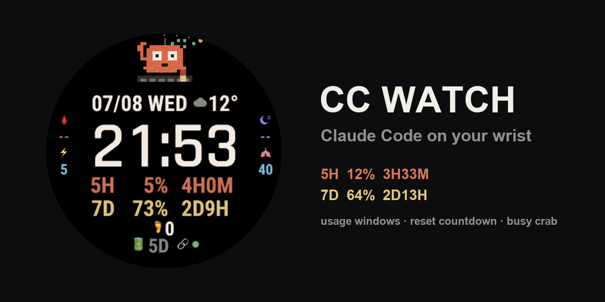

# CcWatch Companion

[中文](README.md) · **English**



> 📖 **Install guide / 安装指导**: [中文](INSTALL.md) · [English](INSTALL.en.md)

Minimal data source for the **CC Watch** Garmin watch face.
One Python file, stdlib only. It reads your Claude Code subscription usage
(from the Claude Code login already on your Mac) and gets it to your watch —
in one of two ways:

| Mode | One-liner | Best for |
|---|---|---|
| **Hosted push** (recommended) | `--push <cloud>/wc/report --token <your-token>` | Zero setup — nothing to expose |
| Self-hosted serve | `--token <secret> --port 8399` | You already run your own endpoint |

**Platforms**: macOS ✅ (token read from the Keychain) · Linux ✅ (reads
`~/.claude/.credentials.json`) · native Windows ❌ (use WSL). Either way the
machine must have Claude Code logged in.

## Hosted push mode (recommended)

1. Open the free watch cloud <https://watch.xiaohuiwangai.cn/wc/cc> and either type the
   pairing code shown on the watch face, or click **Create my token**.
2. On the computer where Claude Code is logged in:

```bash
python3 ccwatch_companion.py --push https://watch.xiaohuiwangai.cn/wc/report --token <your-token>
```

3. Watch face settings: URL `https://watch.xiaohuiwangai.cn/wc/watch`, token `<your-token>`
   (faces paired with a code configure themselves — skip this step).

It reports raw usage every 5 min (`--interval` to change); the cloud renders
fresh reset-countdowns whenever the watch polls.

### Keep it running (one command)

```bash
python3 ccwatch_companion.py --push https://watch.xiaohuiwangai.cn/wc/report --token <your-token> --install
```

Installs a background service (macOS launchd / Linux systemd user unit) that
starts at login and restarts if it dies — survives reboots and closed laptop
lids. `--uninstall` removes it. Prefer manual? tmux / a spare terminal tab
works too.

## 🔄 How often does data refresh

| Stage | Cadence |
|---|---|
| Companion reports Claude usage | **every 5 min** (`--interval`) |
| Watch face refresh | ~every 10 min (Garmin background cycle) |
| Sleep/body data (cloud pulls Garmin) | hourly-ish; "Sync now" on the dashboard |
| Companion silent > 20 min | Claude rings show "?" (other data unaffected) |

## Self-hosted serve mode

```bash
python3 ccwatch_companion.py --token pick-a-secret --port 8399
# test:
curl "http://localhost:8399/watch?t=pick-a-secret"
```

### Expose it to your phone

The watch fetches through Garmin Connect Mobile on your phone, so the URL must
be reachable from the phone's network. Any of:

- **Tailscale Funnel / Serve** (easiest HTTPS)
- **Cloudflare Tunnel**
- Your own reverse proxy / VPS port-forward

## Point the watch face at it

Garmin Connect Mobile → your device → Connect IQ apps → **CC Watch** → Settings:

| Setting | Value |
|---|---|
| Hub /watch URL | `https://your-host/watch` |
| Watch token | `pick-a-secret` |

## What the face shows

- `5H 12% 3H33M` — five-hour window: used % + time to reset
- `7D 64% 2D13H` — weekly window: used % + time to reset
- Pixel crab drums while `busy > 0` (count of running `claude` CLI processes)
- Link light: green = data fresh (<25 min), yellow <60 min, red = stale/broken

## Payload contract (`GET /watch?t=<token>`)

```json
{"ok": true, "ts": 1783500000,
 "fh_used": 12, "wk_used": 64,
 "fh_resets": "3h33m", "wk_resets": "2d13h",
 "busy": 1, "pending": 0, "done_str": ""}
```

Anything speaking this contract works — the reference ccbridge hub serves a
richer version of the same endpoint.

## Support

Free and open source. If it's useful, you can
[buy me a coffee ☕](https://ko-fi.com/xiaohuiwang).
